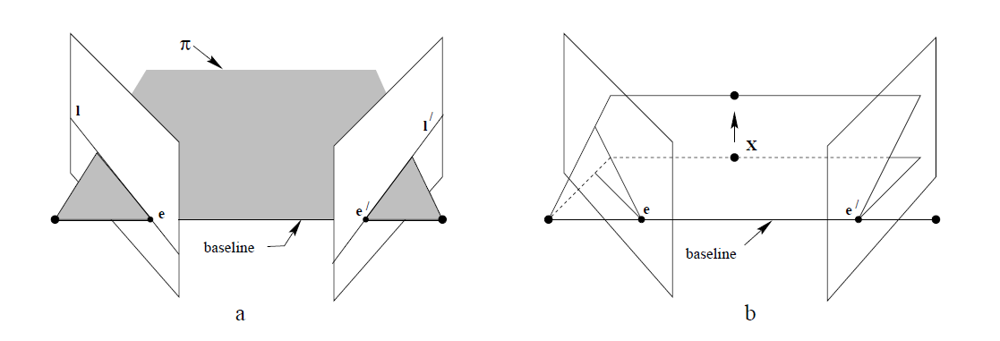

# Multiple View Geometry in Computer Vision

- [Multiple View Geometry in Computer Vision](#multiple-view-geometry-in-computer-vision)
  - [9. Epipolar Geometry and the Fundamental Matrix](#9-epipolar-geometry-and-the-fundamental-matrix)
    - [9.1 Epipolar geometry](#91-epipolar-geometry)
      - [Geometric derivation of fundamental matrix](#geometric-derivation-of-fundamental-matrix)
      - [Algebraic derivation of fundamental matrix](#algebraic-derivation-of-fundamental-matrix)

## 9. Epipolar Geometry and the Fundamental Matrix

Fundamental Matrix:

- $3 \times 3$ matrix of rank 2.
- A point in 3-space $X$ is imaged as $x$ in the first view,and $x'$ in the second,then the image points satisfy the relation $x'^TFx = 0$.
- it canbe computed from corespondences of imaged scene points alone, without requiring knowledge of the cameras' internal parameters or relative pose.

### 9.1 Epipolar geometry

Fig. 9.2. Epipolar geometry

- epipole(极点)
- epipolar plane(极平面)
- epipolar line(极线)

#### Geometric derivation of fundamental matrix

- transfer via the plane $\pi$.在第一个视图中的所有点点集$x_i$和对应的第二个视图的点集$x'_i$都可以投影到一个共面三维点集$X_i$，因此他们是投影对等的关系，可以找到一个2D单应性矩阵$H_\pi$将每个$x_i$映射到$x'_i$。
- constructing the epipolar line. 给定图像点$x'$,过图像点$x'$和极点$e'$的极线$l'$可以被表示为$l' = e' \times x' = [e']_\times x'$.由于$x'$可以被表示为$x' = H_\pi x$，因此我们有：$l' = [e']_\times H_\pi x = Fx$.我们定义$F = [e']_\times H_\pi$为基础矩阵。

结论9.1：$[e']_\times$的秩为2而$H_\pi$的秩为3,因此F的秩为2。
F矩阵代表

#### Algebraic derivation of fundamental matrix

$X$通过$P$矩阵投影到$x$可以表示为 $PX = x$。它的解是
$$X(\lambda) = P^+x + \lambda C$$
$P^+$是$P$的伪逆(广义逆矩阵：奇异矩阵和非方阵没有逆矩阵，但可以有[伪逆矩阵](https://www.jianshu.com/p/609fa0cce409))，$PP^+ = I$, $C$是一个非空向量，也就是相机中心，$PC = 0$。标量$\lambda$参数化射线。取射线上的两个点$P^+x$(当$\lambda = 0$),第一个相机中心点$C$(当$\lambda = \infty$)。这两个点通过矩阵$P'$投影到第二个相机成像面表示为$P'P^+x$和$P'C$。两点连线即为极线：$l' = (P'C)\times(P'P^+x)$。极点$e' = P'C$, 因此$l' = [e']_\times(P'P^+)x = Fx$, 因此$F$可以表示为
$$F = [e']_\times P'P^+$$
